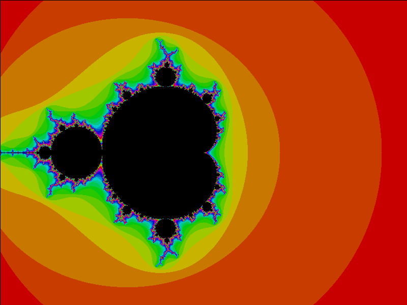
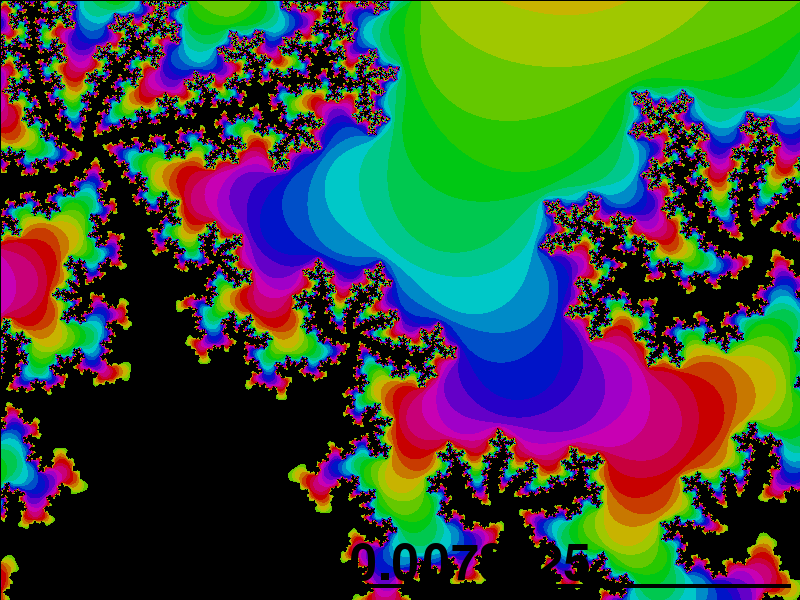

# Generating Mandelbrot Fractals
## Hobby project (2018)
~~~
*Mandelbrot Set.py* -> Normal rainbow generated images
Mandelbrot Set - Zoom.py -> Control the zoom of the plot
Mandelbrot Set - Autozoom.py -> Automatically zooms into plot
Mandelbrot Set - Autozoom Video.py -> Saves the plots into a video
Mandelbrot Set - Closest Approach.py -> Zooms into a specific fractal (sea horse valley)
Mandelbrot Set - Pixelate.py -> Creates a more pixelated plot
Mandelbrot Set - Refine White.py -> Refines the parameters in shades of black
Mandelbrot Set - Refine Black.py -> Refines the parameters in shades of white
Mandelbrot - 3D.py -> Plots 1/4 of the set (positive x,y) in matplotlib
~~~

